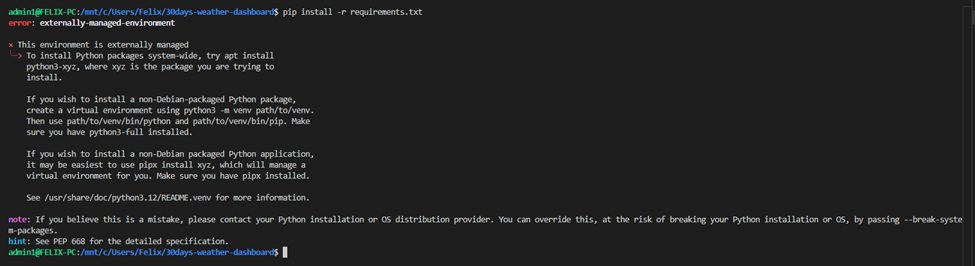
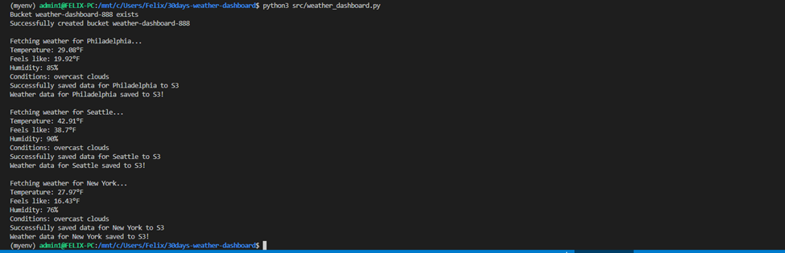

# This project is a Weather Data Collection System that demonstrates core DevOps principles

# Weather Dashboard

Welcome to Weather Dashboard, this project is a Simple Weather Data Collection System that demonstrates core DevOps principles by inegrating some native AWS tools and External/Third party API. This project is developed and maintained by [ShaeInTheCloud](https://www.youtube.com/@ShaeInTheCloud), a YouTube channel dedicated to DevOps tutorials and best practices.

## Table of Contents
- [Introduction](#introduction)
- [Features](#features)
- [Installation](#installation)
- [Usage](#usage)
- [Contributing](#contributing)
- [License](#license)
- [Contact](#contact)

## Introduction

Weather Dashboard is a Simple Weather Data Collection System that is built with Python. This system  create a Weather Dashboard by sending an API request to an external API. The API request fetches real-time weather data for multiple cities, which is then transformed and created into a data structure. This data structure is then automatically stores weather data in AWS S3 as a JSON file. Finally the system timestamps all data for historical tracking. This project aims to demonstrate best practices in Java development, including project structure, coding standards, and documentation.

## Architectural Design:


## Features

- Fetches real-time weather data for multiple cities
- Displays temperature (°F), humidity, and weather conditions
- Automatically stores weather data in AWS S3
- Supports multiple cities tracking
- Timestamps all data for historical tracking


## Installation

### Prerequisites & Technical Architecture:
- **Language:** Python 3.x
- **Cloud Provider:** AWS (S3)
- **External API:** OpenWeather API
- **Dependencies:** 
  - boto3 (AWS SDK)
  - python-dotenv
  - requests

  ```markdown
  ## Project File Structure
  weather-dashboard/
  src/
    __init__.py
    weather_dashboard.py
  tests/
  data/
  .env
  .gitignore
  requirements.txt

### Steps/Setup Instructions

1. Clone the repository:

    ```sh
    git clone https://github.com/ShaeInTheCloud/30days-weather-dashboard.git
    cd 30days-weather-dashboard.git
    ```
    Update the `README.md` file with your documentations.

2. Remove the origin repo:

   ```sh
   git remove -v
   git remove origin
   ```   

3. Create a new repo, add it to your local and push the update to your remote repo:

    ```sh
    echo "# This project is a Weather Data Collection System that demonstrates core DevOps principles" >> README.md
   touch LICENSE.md .gitignore
   git init
   git status
   git add .
   git commit -m "added README.md, LICENSE & .gitignore files"
   git branch -M main
   git remote add origin https://github.com/felix-momodebe-official/30-days-weather-dashboard.git
   git push -u origin main
   git config --global user.name "Felix momodebe"
   git config --global user.email felixmomodebe@gmail.com
   git push -u origin main 
    ```

4. Install dependencies:

    ```sh
    pip install -r requirements.txt
    ```

5. Configure environment variables (.env):
   ```sh
   echo "OPENWEATHER_API_KEY=your_api_key" >> .env
   echo "AWS_BUCKET_NAME=weather-dashboard-${RANDOM}" >> .env
   ```

6. Configure aws credentials
  ```sh
     aws configure
     
     AWS Access Key ID: your_aws-access-key
     AWS Secret Access Key: your_aws_secret_key
   ```

7. Run the application:
 ```sh
    python3 src/weather_dashboard.py
 ```
### Usage

The appplication successfully fetched weather information for the specified locations and saved the data in S3.

### What I Learned

AWS S3 bucket creation and management
Environment variable management for secure API keys
Python best practices for API integration
Git workflow for project development
Error handling in distributed systems
Cloud resource management

### Challenges & Error Encountered:
 My first attemot at running the command:
  ```sh
   pip install -r requirements.txt
   ```
I got an error as shown in the image below:



```markdown
  This error occurs in Debian-based systems (like Ubuntu) that have implemented PEP 668, which prevents pip from modifying system-wide Python packages. There are several ways to fix this. Below is a recommended approach:

  Using virtual Environment:

  # Install python3-venv if you haven't already 
  ```sh
  sudo apt install python3-venv 
  ```
  ### Create a virtual environment 
  ```sh
   python3 -m venv myenv 
  ```
  ### Activate the virtual environment 
   ```sh
   source myenv/bin/activate 
   ```
  ### Now install the requirements 
   ```sh
   pip install -r requirements.txt
   ```
   

  ### Contributing

We welcome contributions to improve The Weather Dashboard Application. If you have a feature request, bug report, or improvement suggestion, please open an issue or submit a pull request.

### Future Enhancement:

Add weather forecasting
Implement data visualization
Add more cities
Create automated testing
Set up CI/CD pipeline


### Steps to Contribute

1. Fork the repository
2. Create a new branch (`git checkout -b feature-branch`)
3. Make your changes
4. Commit your changes (`git commit -m 'Add some feature'`)
5. Push to the branch (`git push origin feature-branch`)
6. Open a pull request

### License

This project is licensed under the MIT License. See the [LICENSE](LICENSE) file for more details.

### Contact

For any questions or inquiries, please reach out to us at [ShaeInTheCloud](https://www.youtube.com/@ShaeInTheCloud) or [SuccPinn Cloud & DevOps + AI](https://www.youtube.com/@SuccPinnCloudDevOps)

Happy coding!

